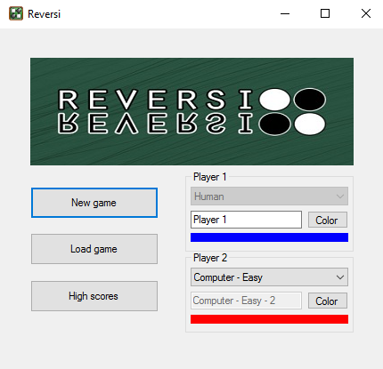
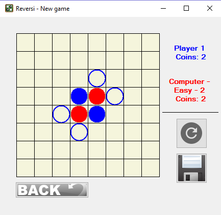
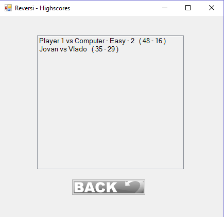

----------
  README
----------

# Reversi-VP

Како се игра #1
--------------------------
Reversi е игра од тип стратегија наменета за 2 играчи кои играат на површина 8x8.
Постојат 64 идентични делови во играта кои се викаат дискови и се во различна боја во зависност од противниците.
Играта започнува така што играчот поставува диск на површината со соодветната боја на диск.
Во текот на играта, секој диск од противничката боја кој е во права линија и "сврзан" со дискот кој го поставува играчот што е на ред се обојува во соодветната боја на играчот кој го поставува дискот.
Целта на играта е да се освои поголемиот дел од површината со вашата боја.
Кога нема да постојат квадратчиња за поставување дискови, играта завршува и победник е оној чија боја доминира на површината за играње.

Стартување на играта #2
--------------------------

При стартување на играта, на корисникот му е овозможено да избери 3 типови на дуел и тоа:

1. Корисник против Корисник.
2. Корисник против Компјутер (Easy).
3. Корисник против Компјутер (Hard).

При избирање на тип 1. Оваа опција му овозможува на корисникот да игра против човек меѓусебно (дуел).
При избирање на тип 2. Оваа опција му овозможува на корисникот да игра против компјутерот со ниво на тежина "Easy".
При избирање на тип 3. Оваа опција му овозможува на корисникот да игра против компјутерот со ниво на тежина "Hard".

Откако корисникот одбрал соодветниот тип на игра, овозможено му е да одбере со каква боја на пулови тој сака да игра. Доколку е одберен тип 1 и двајцата корисници си одбираат боја на пуловите.
Исто така овозможено е и поставување на име односно т.н "Nickname" за секој од корисниците.

Откако ќе се подесат соодветно параметрите по желба на корисникот играта се започнува со притискање на копчето "New Game". Со притискање на ова копче се отвора новата панела каде што се наоѓа играта.
Корисникот ја започнува својата игра. Од десната страна на таблата за играње ("Game Board") се наоѓаат имињата на играчите и соодветниот број на пулови на секој од нив при моменталната состојба на играта.

Веднаш под тоа се наоѓаат две копчиња. Првото копче слуши за ресетирање на играта, кое при клик го прашува корисникот дали сака да ја зачува играта со моменталната состојба или сака да започне нова игра.
Второто копче служи за зачувување на играта. Доколку корисникот во даден момент сака да ја исклучи апликацијата но не сака да ја загуби играта, со притискање на ова копче ќе му се отоври дијалог за зачувување,
каде што ќе треба да внесе име под кое сака да ја зачува моменталната игра. Екстензијата со која ќе се зачувуваа овој тип на датотеки е ".rvs".

Во долниот лев агол од апликацијата се наоѓа копче "Back". Ова копче служи за враќање назад на главното мени. При притискање на ова копче, апликацијата го прашува корисникот дали сака да ја зачува играта во моменталната состојба
пред да се врати назад на главното мени или не. Доколку сака да се сними, повторно се отвора дијалог каде што корисникот ќе треба да внесе соодветно име.

Сите копчинња имаат соодветен опис кога корисникот ќе го потави курсорот врз соодветното копче. (Hover)

Доколку при стартување на играта корисникот не сака да почне нова игра, туку да продолжи со некоја игра којашто предходно му е зачувана, со притискање на копчето "Load game", му се отвора прозорец кое му овозможува да одбере
која игра сака да ја вклучи. Одбраната игра продолжува од таму каде што корисникот ја зачувал, со истите параметри кои ги одбрал при нејзиното започнување (Боја на пулови, противник и име).

Исто така во главното мени има копче "High scores". Со притискање на ова копче се отвора нова панела кадешто се представени сите досега одиграни (завршени) игри и се сортирани во опаѓачки редослед според бројот на осовиени пулови.
Под листата се наоѓа копче "Back" коешто при притискање не враќа на главното мени.

Функционалност на играта #3
---------------------------
Главната класа во која се наоѓа целата функционалност на играта е класата "Rvs". Во се наоѓаат две инстанци од класата "Player" во која се чуваат податоците за секој од играчите.
Исто така оваа класа ја содржи и матрицата преку која ја илустрираме самота функционалност на играта. Во оваа класа се врши проверката за моменталната состојба, кои потези се валидни а кои не, при избор на одреден (валиден) потег
кои противнички пулови ќе бидат "превртени" итн. Сите овие функции се извршуваат во методот "move()" кој се наоѓа во кодот на главната форма.
Се проверуваат деталите за текот на играта како на пример дали играта е завршена, дали играчот кој што е на ред има потег, доколку има потегот да биде соодветно извршен и да се смени состојбата на играта, а доколку нема противникот да биде на потег.
Исто така имаме и класа "Highscores" каде што ја чуваме статистиката на играта од одиграните игри. Функционира на тој начин што при секое завршување доколку играчот одбери неговиот резултат да биде зачуван резултатот се додава во постоечката листа.
При исклучување на играта се прави серијализација на "Highscores" во фолдерот "AppData" (HighScores.hrvs) и при секое ново стартување на апликацијата, овој фајл се десеријализира и статистиката ги содржи сите снимени резултати.

  - Опис на главниот метод "move()"

При повикување на методот "move()" најпрво се проверува дали играта е завршена, односно дали играчите немаат можни потези. Доколку играта е завршена во зависност од тоа кој играч има повеке пулови се одредува победникот.
Ако играта не е завршена се проверува кој играч е на потег. Се проверува дали тој има можни потези. Доколку нема, го менуваме редот и повторно ја повикуваме функцијата, а ако има, се проверува дали тој е корисник или е компјутерот. Доколку е корисник се чека корисникот да си одбере соодветен потег (односно да кликне на екранот на местото каде што сака да го постави својот пул), а доколку е компјутер, во зависност од тоа на кое ниво се игра се генерира соодветен потег. Кога ќе се изврши одбраниот потег се менува матрицата на состојбата, се менува редот и повторно се повикува функцијата. 

Историја на играта #4
---------------------------
1. Оригинална верзија
Играта Reversi е изработена во 1833 од некој од двајца Англичани (Lewis Waterman или John W. Mollett) кои меѓусебно тврделе дека едниот е "измамник" и не придонесил ништо кон креирањето на играта.
Во 1983 година, добро-познатиот Германски објавувач на игри Ravensburger почнува со произведување на играта како една од нивните први трофеи.
Неколку години подоцна, постоеле шпекулации, кои до сега се без никаква документација, дека играта има уште по древни потекла.

2. Модерна верзија
Модерната верзија на играта - истата употребувана во интернационални турнири е маркетирана и препозната како Othello.
Усовршена од Gogo Hasegawa (автоним: Satoshi Haswegawa) во Јапонија во 1970-тите. Постојат 2 типови од оригиналната игра:
  
  - Првите четири делчиња (дискови) се поставени во центарот, во стандардна дијагонална 2x2 матрица.
  - Секој играч има max. 64 дискови, отколку да бидат ограничени на 32 дискови.

Hasegawa го воспоставува Japan Othello Association во Март 1973 година, и го одржува првото национално првенство во Reversi во Април, 1973 година во Јапонија.
Јапонската компанија за игри Tsukuda Original ја лансира Othello (Reversi) во доцен Април, 1973 во Јапонија под негово авторство, кој одма води кон комерцијален успех.

	

Автори на играта #5
---------------------------
- Јован Давчев 141037

- Александар Богевски 141071

- Владо Солаков 131202

